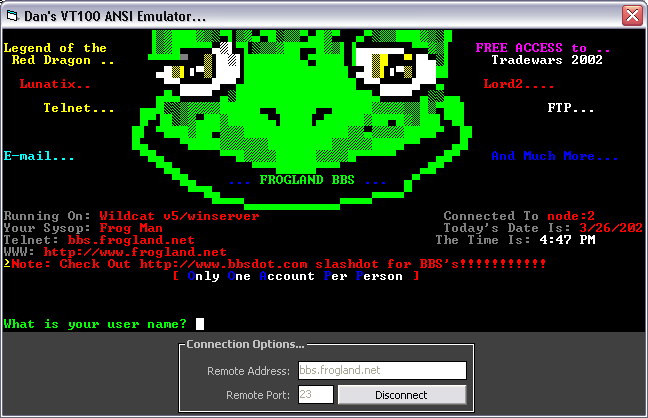



## VT100 ANSI Terminal Emulator Demonstration

### Description

This program demonstrates how to create a VT100 terminal emulatior with ANSI capability (Remember the software you used to use to connect to a BBS?). It demonstrates control character processing, ANSI mode control sequence processing, and escape sequence processing. It also demonstrates how to connect to, and interact with, a remote server using the Winsock control.
 
### More Info
 
You should have a basic understanding of VT100 programming if you hope to understand this code.

none that I know of.

             |
---                |---
**Submitted On**   |2002-03-26 15:44:00
**By**             |[Daniel S\. Soper](https://github.com/Planet-Source-Code/PSCIndex/blob/master/ByAuthor/daniel-s-soper.md)
**Level**          |Advanced
**User Rating**    |4.8 (43 globes from 9 users)
**Compatibility**  |VB 6\.0
**Category**       |[Complete Applications](https://github.com/Planet-Source-Code/PSCIndex/blob/master/ByCategory/complete-applications__1-27.md)
**World**          |[Visual Basic](https://github.com/Planet-Source-Code/PSCIndex/blob/master/ByWorld/visual-basic.md)
**Archive File**   |[VT100\_ANSI656803262002\.zip](https://github.com/Planet-Source-Code/daniel-s-soper-vt100-ansi-terminal-emulator-demonstration__1-33098/archive/master.zip)

### API Declarations

Many. See source code.

